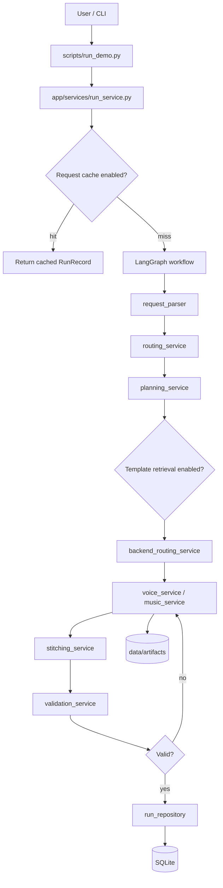
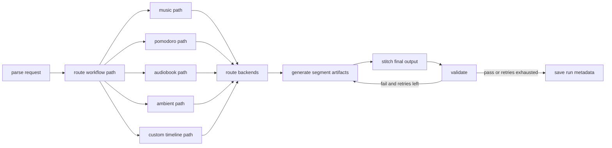
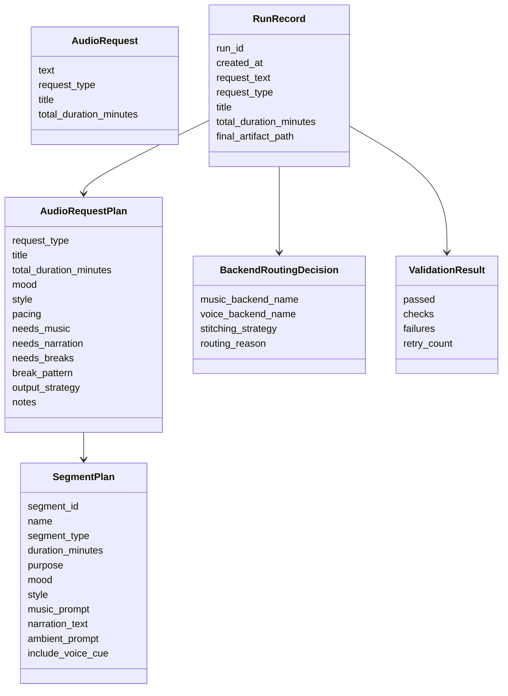

# orchestrai-audio Overview

This document analyzes the repository from three perspectives:

- Software Architect
- Software Developer
- Product Manager

It is meant to help a new contributor understand what exists today, why the code is shaped this way, and what questions should drive the next round of development.

## Executive Summary

`orchestrai-audio` is a phased, local-first audio workflow engine prototype. The repository is intentionally simple and readable. It already demonstrates a full request-to-artifact lifecycle:

1. Parse a freeform request
2. Classify the request type
3. Build a structured plan
4. Route the request through a LangGraph workflow
5. Choose backends
6. Generate per-segment artifacts
7. Stitch a final output
8. Validate results and retry once if needed
9. Persist metadata in SQLite
10. Optionally use local template retrieval and local caching

The codebase succeeds at being easy to inspect and extend. Its main limitation is that it is still a CLI-first orchestration demo rather than a production-ready service. The FastAPI layer is planned but not implemented.

## Repository Snapshot

### Core Modules

- `app/core`: config and SQLite setup
- `app/models`: dataclass schemas for requests, plans, routing, validation, and saved runs
- `app/services`: parsing, planning, backend routing, generation, validation, caching, retrieval
- `app/graph`: LangGraph state, main workflow, and routed mode-specific helpers
- `app/storage`: artifact writing and run persistence
- `scripts`: local CLI demo
- `tests`: lightweight unit coverage

### Supported Request Types

- `music_session`
- `pomodoro_session`
- `audiobook`
- `ambient_session`
- `custom_timeline`

## System Architecture

## Workflow Shape

## Data Model Summary

## Perspective 1: Software Architect

### Architectural Strengths

- The system is split into clear layers: parsing, planning, routing, generation, validation, storage.
- LangGraph is used narrowly and appropriately. The workflow remains readable and explicit rather than turning into framework-heavy logic.
- Data contracts are centralized in `app/models/schemas.py`, which reduces ambiguity between stages.
- The repository uses local-first primitives: SQLite, filesystem artifacts, JSON-compatible dataclasses.
- Optional features are isolated behind flags, so the core path remains stable.

### Architectural Risks

- `run_service.py` and the graph together form the practical orchestration boundary, but there is no API boundary yet. This limits external integration and MCP usefulness.
- SQLite stores most business data as JSON blobs. That is fine for this stage, but weak for querying, reporting, or partial updates at scale.
- The workflow state is flexible but not guarded by runtime validation. A missing field would fail at runtime rather than at a stricter state-contract layer.
- The retry loop re-enters generation directly. That is simple, but future retry scenarios may need partial retry semantics or artifact cleanup rules.
- The current architecture is single-node and local-disk-based. It is not ready for distributed execution, remote workers, or object storage.

### Scalability View

Short-term scale:

- Good enough for demos, local development, and simple CLI usage
- Easy to evolve because modules are small and responsibilities are clear

Medium-term scale concerns:

- artifact storage on local disk will become cumbersome
- JSON-in-SQLite metadata will become harder to analyze
- graph branching may grow noisy as more request types or backend variants are added

### Architectural Recommendations

- Add a small FastAPI layer before adding any more advanced integration surfaces.
- Keep the graph explicit, but consider grouping repeated path patterns once more workflows exist.
- Introduce a queryable metadata model only when real API consumers need filtering or dashboards.
- Treat the current storage layer as a local adapter so future object storage or relational persistence can be introduced without disturbing services too much.

### Architect Questions

- Should `RunRecord` remain a single JSON-heavy object, or should runs and segments become first-class DB rows once the API exists?
- Is the current retry loop enough, or will future failures require retrying only certain segment types?
- Should backend routing and planning remain fully synchronous, or is background job execution part of the intended future?

## Perspective 2: Software Developer

### Code Structure And Maintainability

- The code is readable and heavily documented.
- Functions are small and mostly do one thing.
- There is little abstraction overhead; the repo favors explicit flow over clever indirection.
- Dataclasses and `to_dict()`/`from_dict()` helpers are a practical fit for this stage.

### What Is Implemented Cleanly

- `request_parser.py`: stable rule-based classification and duration extraction
- `planning_service.py`: clear per-request-type planning functions
- `backend_routing_service.py`: understandable rules for backend selection
- `validation_service.py`: easy-to-audit validation checks
- `cache_service.py` and `template_retrieval_service.py`: good examples of optional feature isolation
- `app/graph/subgraphs/*`: simple request-type-specific entry points

### Code Smells Or Friction Points

- There is some repeated pattern across subgraph modules: build plan, append note, assign run id, then generate artifacts.
- `planning_service.py` is now one of the larger files and is accumulating multiple responsibilities:
  - request-type plan construction
  - mood/style/pacing heuristics
  - template enrichment hook via the top-level entry point
- The generated artifact services are mixing two concerns:
  - artifact creation policy
  - file-format generation logic
- Config is environment-variable-driven, but there is no one place that prints or summarizes the active runtime mode.

### Testing Assessment

Strengths:

- The test suite is lightweight and fast.
- Core deterministic paths are covered: parsing, planning, backend routing, validation, cache serialization.

Gaps:

- No tests for the LangGraph workflow path itself
- No tests for SQLite persistence behavior
- No tests for optional real integrations
- No tests for cache hit behavior in `run_service.py`

### Developer Recommendations

- Add one integration-style test for the non-graph `run_pipeline()` path once `langgraph` is installed in CI.
- Split heuristic helpers out of `planning_service.py` if the file grows much more.
- Add a small utility to summarize active feature flags for debugging.
- Consider a tiny `result_summary_service.py` if output formatting grows beyond the current CLI.

### Developer Questions

- Should the project keep the strict “functions over classes” style as integrations grow, or are a few backend adapter objects acceptable later?
- Is `langgraph` guaranteed to be available in contributor environments, or should there be a non-graph local fallback runner for development?
- When FastAPI arrives, should it call `run_pipeline()` synchronously or wrap it in background tasks?

## Perspective 3: Product Manager

### Product Value Today

The repository already demonstrates the main story well:

- a user gives a natural-language request
- the system identifies what kind of audio experience they want
- the system creates a structured plan
- the system produces artifacts and metadata that can be inspected

That makes it strong as:

- a technical prototype
- a portfolio/GitHub demo
- an internal reference architecture for an “agentic media pipeline”

### User Experience Assessment

Strengths:

- CLI demo is straightforward
- request examples are concrete and relatable
- artifacts are inspectable on disk
- phase-based docs make the repo easy to follow

Weaknesses:

- no API yet, which limits external usability
- no direct concept of “preview plan only” vs “generate now” in the CLI
- stub outputs are still developer-facing rather than user-facing
- no standardized example outputs or screenshots for GitHub readers

### Feature Maturity View

Strongly established:

- request typing
- structured planning
- routing
- validation
- persistence

Partially established:

- real integrations
- reusable planning templates
- caching

Not established yet:

- API product surface
- user authentication or tenancy
- artifact playback UX
- retrieval beyond static local templates

### Product Recommendations

- Add a simple API before adding more “platform” features.
- Add one or two polished example outputs in the repo for GitHub readers.
- Add a “plan-only” CLI mode because that would be a natural user step before generation.
- Decide whether the core product is:
  - a developer framework for audio orchestration
  - a local productivity tool
  - a backend service for applications

That product decision will change what should be built next.

### Product Questions

- Is the primary target user a developer, a creator, or a productivity end user?
- Should the system optimize for generation quality, orchestration transparency, or ease of integration?
- Do future users need repeatability and inspectability more than creative variety?
- Is the intended monetizable surface an API, a desktop/local app, or a reusable orchestration library?

## What The Codebase Is Doing Well

- It consistently favors clarity over abstraction.
- Phased development is documented unusually well.
- Optional features do not break the simple path.
- The repository tells a coherent story from request to saved run.

## Main Gaps

- No FastAPI implementation yet even though the product direction repeatedly references it
- No end-to-end graph runtime test coverage
- Real integrations are still minimal and opportunistic
- Persistence is practical but not yet query-friendly
- No external interface beyond the CLI

## Suggested Next Steps

### Highest-Leverage Next Moves

1. Implement the FastAPI layer that Phase 2 originally called for.
2. Add one end-to-end integration test for a real run path.
3. Expose a “plan-only” execution mode.
4. Add one richer example artifact bundle in the repo or docs.

### If The Goal Is Better Engineering

1. Add CI coverage for graph execution once `langgraph` is available.
2. Add a runtime configuration summary for debugging enabled features.
3. Add a simple migration story for future SQLite schema evolution.

### If The Goal Is Better Product Demo Quality

1. Show one real voice output example with `pyttsx3`
2. Add screenshots or sample JSON outputs to docs
3. Add a future HTTP interface for `/plan` and `/generate`

## Suggested Roadmap Refinement

The current numbered phases are useful, but the repo now has one notable inconsistency: Phase 2 is still unchecked even though later phases depend on the idea of an API. That is a documentation signal that the roadmap has diverged from the actual implementation order.

Recommended fix:

- either implement Phase 2 next as the missing FastAPI layer
- or explicitly rename it in the roadmap as “deferred API layer” so readers are not confused

## Final Assessment

From an architect’s perspective, the repository is a solid local-first orchestration prototype with a clean upgrade path.

From a developer’s perspective, it is readable, maintainable, and thoughtfully staged, with the main need being a few more integration tests and some eventual module splitting if planning logic keeps growing.

From a product perspective, it already communicates a compelling concept, but it still needs an actual service interface to move from “good technical demo” to “usable platform surface.”

Overall, the codebase is in good shape for its purpose. The most important next decision is not “more features,” but “what is the primary interface this product wants to own next?”

